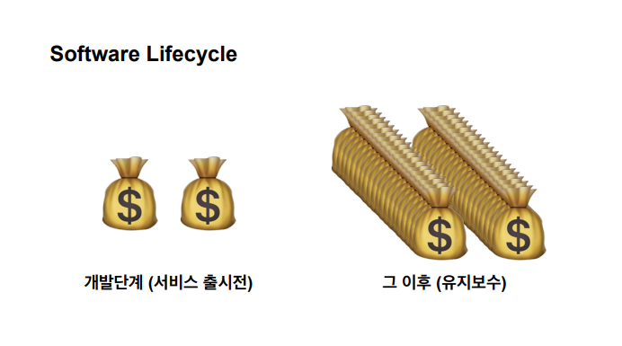

- 코드에 대한 판단은 풀어야 하는 문제와 처한 상황에 따라 다르다.
    - 좋은 코드로 value를 창출하는 일 : 개발자 업무

### Legacy Code = 하위 호환성 + 도메인 히스토리 + 타인이 작성
Legacy code is source code that relates to a no-longer supported or
manufactured operating system or other computer technology
… 
More recently …. Among the most prevalent are source code inherited
from someone else and source code inherited from an older version of
the software

wikipedia

### Legacy가 부정적으로 다가오는 이유
- 서비스 런칭 후 고도화 단계
  - 신규 기능 추가
  - 신규 기능 추가 + 이전 정책 충돌
  - 예외케이스로 허용
  - 신규기능 오픈
  - 반복
- 혹은 다른 고도화 단계
  - 기획 혹은 개발 담당자가 바뀜
  - 히스토리를 파악하지 못한 상태로 신규 개발 요건을 받아옴
  - 기존 코드에 추가 시작
  - 반복

### Legacy는 현재 서비스를 굴러가게 하는 일등공신
"Indeed, the ratio of time spent reading versus writing is well over 10
to 1. We are constantly reading old code as part of the effort to write
new code. ...[Therefore,] making it easy to read makes it easier to
write.”

Robert C. Martin

### Why Should I Write Clean Code

- 시스템 초기 개발 비용 < 서비스가 커지면 커질수록 유지보수 비용이 훨씬 증가 하게 됨 
- 유지보수에 대한 비용이 많이 발생한다 
- 고로 코드를 잘 작성해야한다
- 개발자들이 클린코드를 알고
- 이를 바탕으로 코드를 작성해야 하는 이유

