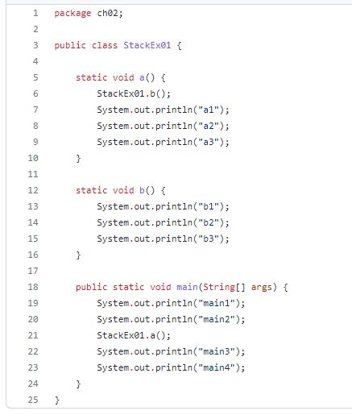
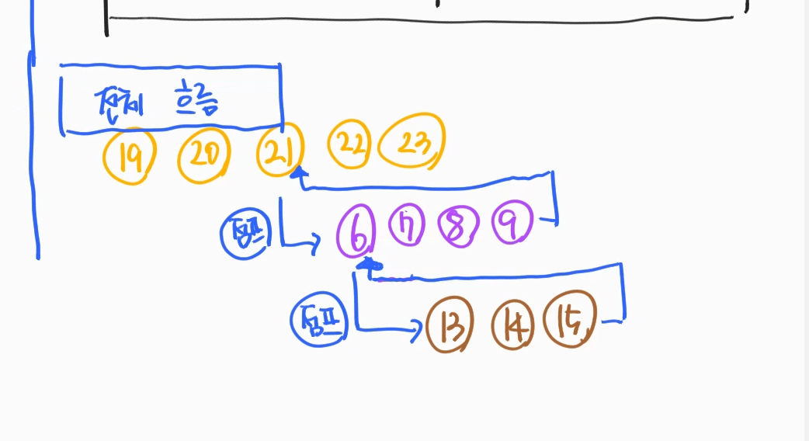
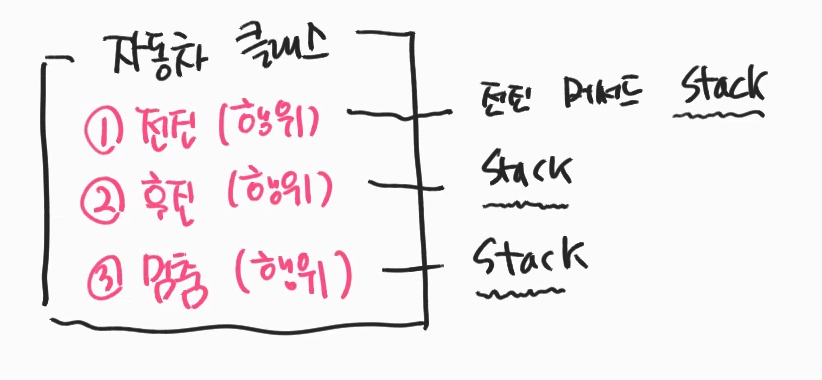

### 1. Reference variable

#### 1.1 Reference(참조)
- int num = 10;
    - 일반변수 : (컴파일 시점에)크기가 정해져 있는 것 
- A a; 
    - 래퍼런스 변수 : (컴파일 시점에)크기가 정해져 있지 않는 것
    - class A :  프로그램이 실행 되었을 때 (= runtime) → new 연산자로 할당이 될 때 크기를 알 수 있다.
<br/>
      
````java
public class VarRefEx01 {
    int num; // → 변수를 선언한다.
    int num2 = 10; // → 변수를 초기화 한다. → 메모리에 할당 한다.
    // int형(일반변수)은 "미리 알고" 4Byte의 메모리를 준비한다.
    A a = new A();  // 주소값만 저장한다.(4Byte) → heap의 저장영역 주소
    //custom type 은 크기를 알 수 없어서(실행할 때 알게된다. new를 통해, 컴파일 시점에는 모른다.)
    //a라는것은 주소다
}
````
- 일반변수 
  - 정적이다. 
  - 알 수 있다.
  - 값을 가지고 있다.
  - why? **컴파일 시점에 크기를 알 수 있어서.**
- 참조변수 
  - 동적이다.
  - 알 수 없다. 
  - 주소를 가지고 있다.
  - why? **컴파일 시점에 크기를 알 수 없어서.**
  > 크기를 알 수 없으니 메모리 공간에 설계가 불가능하다.<br/> 
  > → 다른 넓은 공간을 임대한다. <br/>
  > → 그 공간에 데이터를 저장을 한다. <br/>
  > → 실제 비싼 창고에는 주소만 저장해 둔다 <br/>
  - 별도로 비용이 낮은 공간 → heap memory area
  
- 일반변수 : 기본자료형
- 래퍼런스 변수 : 클래스 자료형\

### 2. Method
- 가정
- 손님.class ↔ 커피머신.class
- 손님 클래스에서 커피 주문하기, 커피 마시기 = Method
- 커피머신 클래스에서 커피 만들기 = Method
> Method → 클래스의 행위

#### 2.1.1 Method stack memory
- a.java → compile → a.class → 로드 → JVM → ***실행*** → a.class 내부 static 키워드 체크 → static 메모리 영역 할당
- 실행이란 ?
  - 클래스 로드
  - static 키워드 찾기
  - main method 실행
  - main이 어떻게 실행되나 ? static method이다.
  
- a.class 의 static영역에 main메소드 적재
- main queue open → stack memory area 생성
> 로드 - static 키워드 탐색 - main queue open - stack공간에 main영역 생성

#### 2.1.1. Method stack memory
- 자료구조 : 자료를 저장하는 구조
- Queue
  - 입력방향 == 출력방향
  - 출구가 있다.
  - FIFO(First In First Out)
  
- Stack
  - 입력방향 != 출력방향
  - 출구가 없다.
  - LIFO(Last In First Out)

#### 2.1.2 자료구조 관점에서의 class파일 실행순서
- [코드보기](https://github.com/GyeomFka/java-dare/blob/master/src/main/java/ch02/StackEx01.java)
 - 흐름.txt
   - .java -> jvm을 위한 컴파일 -> .class -> 실행 -> jvm class파일 받음
1) class파일 로드
2) static키워드 서치
3) StackEx01이라는 class영역에 
   - static공간이 생김 (but 메소드 내부영역은 뜨지 않는다.)
   1) a() 
   2) b()
   3) main()
   
4) main 실행 을 자료구조 관점에서 보면
   </br>  
   </br>
   </br>   

 > * main method가 stack에 올라온다. → ***자바 프로그램 실행*** 
 > * main method가 stack에서 pop된다. → ***자바 프로그램 종료***


### 3. scope of variable
#### 3.1 메모리 관점에서의 변수범위
- 지역번수 → stack 영역, 생명주기 짧다.
- 전역변수 → heap, static 영역, 생명주기 길다.
    * 생명주기 → 메모리에 떠있는 시간
    
> stack 지역변수 → method실행 → 메모리 할당 → mthod 종료 → 메모리 반환 → 생명주기 짧다.
> 
> heap 전역변수 → new 명령어 메모리 할당 → 더 이상 참조되지 않을 때 메모리 반환
> 
> static 전역변수 → main이 실행되기 전에 미모리 할당 → main종료 → 메모리 반환

```java
class Sample {
    int a = 5;
    public static void main(String[] args) {
        Sample s = new Sample();
        System.out.println(s.a); //heap공간에 a가 할당된다.
        System.out.println("여기서부터 s를 참조하지 않기 때문에 메모리에서 사라진다.");
    }
}
```
- [코드보기](https://github.com/GyeomFka/java-dare/blob/master/src/main/java/ch02/StackEx02.java)

#### 3.2 return of method
- Method : 클래스의 행위
  </br>
- 가령 전진() 이라는 메서드 종료가 종료되면 전진() 내부 int '현재위치' 값은 사라짐 
  </br>→ 현재위치를 다른 곳에선 찾을 수 없다
  </br>→ ***그래서 return을 해 줘야함***
- Return을 해야하는 이유  
```java
public class MethodEx02{ 
    static void add() {// 호출이 되면 stack공간이 메모리에 만들어진다.
        int sum = 5 + 6; //
        System.out.println(sum);
    } //종료가 되면 sum값은 사라진다

    public static void main(String[] args) {
        add(); //add의 sum을 돌려 받을 수 없기때문에 add()의 return값을 받아야 한다.
    }
}
```
