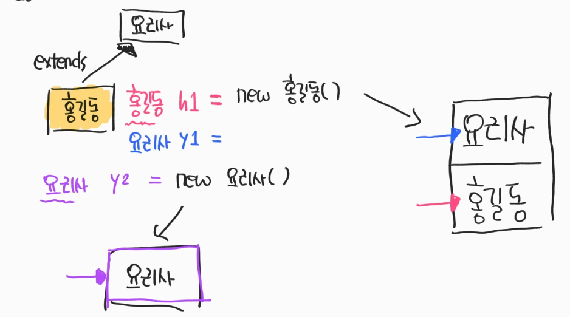

### 1.객체지향 프로그래밍 이해
#### 1.1. instance란?
- 클래스 : .java로 정의된 ***설계도***
- 인스턴스 : heap공간에 있는 클래스 ? → ***new 가 된 것***
- 오브젝트 : 인스턴스가 될 수 있는것 → ***new 가 가능한것들***
    - 구체적인 것 (셀 수 있는) 
    - 추상적인 것 (셀 수 없는)
  
#### 1.2. 클래스의 상태와 행위
- 클래스 구성
  - 필드 : 상태
  - 메서드 : 행위
  
- Object-Oriented Programming
  > 1) 상태는 스스로 변하는게 아니라, 행위에 의해 변한다.
  >    - 클래스의 필드는 메서드에 의해서 변한다.
  >    - 직접 상태를 변화 하는 것 : 현실에서의 말도 안되는일 → 근거가 없는 변화
  >    - ***상태에 접근제어(private)*** + ***행위를 통한 상태 변화*** → ***근거가 명확한 변화***
  > 

### 2. 상속
#### 2.1. 상속 → Extend : 확장하다.
- 상속은 추상화를 해준다.
- 상태, 행위 물려받는다.
  - import 개념 : 상태, 행위를 가져와서 사용할 수 있다. → 상속과는 다른 개념
  
> * 엔진( 타입일치 X ) → 자동차  
> * 햄버거( 타입일치 O )( 추상화 된 존재 ) ← 치즈버거, 치킨버거

- 상속과 콤포지션 예재 : [코드보기](https://github.com/GyeomFka/java-dare/blob/master/src/main/java/ch05/OOPEx02.java)

#### 2.2. 상속활용
- 상속을 잘 활용하는 것이란?
  - 재사용의 관점에서 상속 == 콤포지션 
  - 같은 구현이 가능하지만 상속은 어떻게 쓰는게 가장 효율적인가 ?
  
##### 2.2.1. 다형성
- B extends A (B가 A를 상속할 때)
   
  
- Heap공간에 B를 호출하면 (new B();) → B, A가 함께 뜬다. 
- Heap공간에 A를 호출하면 (new A();) → A만 뜬다.
- 상속관계에서의 호출은 A or B = new B(); 이지만 
  - A로 호출 → A를 바라본다.
  - B로 호출 → B를 바라본다.

[코드보기](https://github.com/GyeomFka/java-dare/blob/master/src/main/java/ch05/OOPEx03.java)
  

##### 2.2.2. Overloading (과적재) 이란?
- Method이름이 같아도 다른 Method로 인식한다 → 매개변수의 ***타입***, ***갯수***의 따라서

#### 2.2.3. 왜 사용하는가 ?
- 활용해야 하는 Method이름이 통일된다. → 매개변수를 다르게 하면 다른 Method호출

#### 2.2.4. 한계점, 단점
- 경우의 수에 따라 Method가 계속 늘어난다.

> 경우의 수가 제한이 있다면, 효율이 나오지만  
> 경우의 수 제한이 없다면, 비효율적이다

#### 2.2.5 overloading의 한계점 극복 → overriding
- override : 부모의 메서드를 무효화 하다
  - 부모가 갖고있는 메소드를 동일하게 자식이 갖게 되면 자식타입으로 실행이 된다.
  
- (B가 A를 상속받고) 상속에서 A a = new B();
  - A와 B가 같은 메서드를 같고 있을때
  - B의 메소드를 실행한다
  - A의 메소드를 실행시킴에도 B의 메소드가 호출 되는것 → ***동적바인딩***
    
 

#### 2.3. 추상 클래스
 
- new 연산자 사용 할 수가 없다 → 메모리에 띄울수가 없다.
- 가구는 의자와 침대의 추상화 된 개념이므로 가구를 메모리에 new 할 수 없다. 
> 단순 클래스 상속 : 구현부 에서의 메서드 호출을 위해서 해당 함수가 껍데기 메서드로만 존재하기 때문에 
> 추상클래스로 사용을 하는게 효율적이다. 
> 추상클래스에 추상 메서드 생성이 가능하다. → 강제성 부여 

- 추상메서드 : 몸체{} 가 있으면 ***안된다.***
  - 강제성 부여하기 위해
- 몸체{} 가 있는 메소드 생성도 가능하긴 하다.

[코드보기](https://github.com/GyeomFka/java-dare/blob/master/src/main/java/ch05/OOPEx07.java)
